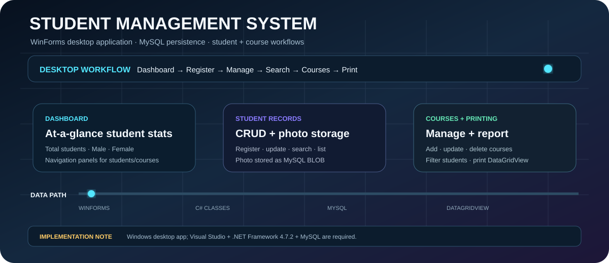
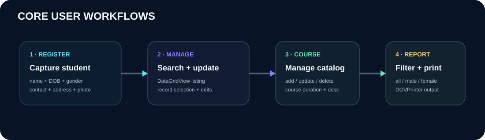
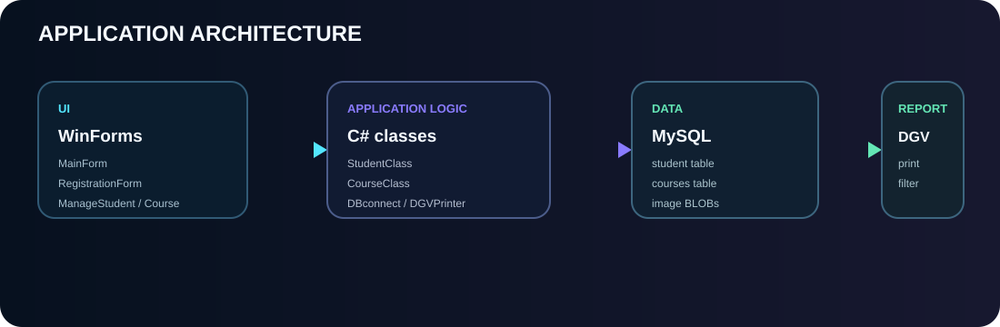

<p align="center"></p>

<p align="center">


</p>

<h1 align="center">🎓 Student Management System</h1>

<p align="center">A Windows desktop student-record and course-management application built with <strong>C# WinForms + MySQL</strong>, with search, photo storage, dashboards, and printable student reports.</p>

> <strong>Platform:</strong> Windows desktop application. It targets <strong>.NET Framework 4.7.2</strong> and is intended for Visual Studio.

<p align="center"></p>

## ✦ What the application does

The repository contains a traditional WinForms CRUD application centered on two datasets: <strong>students</strong> and <strong>courses</strong>.

### 👤 Student management

- Add students with name, date of birth, gender, contact, address, and photo.
- View records in `DataGridView`.
- Search by first name, last name, or address.
- Update student details.
- Store student photos as MySQL BLOB data.
- Validate required fields and check age between 10 and 100 years.

### 📚 Course management

- Add courses.
- View the course table.
- Update course name, duration, and description.
- Delete courses.

### 🖨️ Printing and reporting

`PrintStudent.cs` uses the included `DGVPrinter` helper to print student records and can filter the dataset by:

`All` · `Male` · `Female`

<p align="center"></p>

## 🧱 Architecture

```text
WinForms UI
    │
    ▼
C# application classes
    │
    ├── StudentClass
    ├── CourseClass
    ├── DBconnect
    └── DGVPrinter
    │
    ▼
MySQL
    ├── student
    └── courses
```

### Main forms

| Form | Responsibility |
|---|---|
| `MainForm` | Dashboard + navigation |
| `RegistrationForm` | Add/list students |
| `ManageStudent` | Search/select/update students |
| `AddCourse` | Add courses |
| `ManageCourseForm` | Update/delete courses |
| `PrintStudent` | Filter and print student data |

## 🗂️ Data model

### `student`

`ID` · `First Name` · `Last Name` · `D.O.B` · `Gender` · `Contact Number` · `Address` · `Photo`

### `courses`

`Course ID` · `Course Name` · `Course Duration` · `Description`

## 🔐 Database connection

`DBconnect.cs` currently uses a local development connection to `studentdb` on MySQL port `3306`.

```text
datasource=localhost
port=3306
username=root
database=studentdb
```

The connection is hard-coded in the source. That is fine for a local learning project, but credentials should be externalized before real deployment.

## 🚀 Run locally

### Requirements

- Windows
- Visual Studio with desktop/.NET Framework support
- .NET Framework 4.7.2
- MySQL Server

### 1. Clone

```bash
git clone https://github.com/Sai-Srinivas-P/STUDENT_MANAGEMENT_SYSTEM.git
cd STUDENT_MANAGEMENT_SYSTEM
```

### 2. Create the database

```sql
CREATE DATABASE studentdb;
```

Create the `student` and `courses` tables to match the SQL used by `StudentClass.cs` and `CourseClass.cs`.

### 3. Open and build

Open `Student Management System.sln` in Visual Studio, restore the included package references, then build the solution.

### 4. Run

`Program.Main()` launches `MainForm`.

## 📦 Project dependencies

- C# / Windows Forms
- .NET Framework 4.7.2
- MySQL Connector/NET (`MySql.Data`)
- Guna.UI2.WinForms 2.0.2
- DGVPrinter helper included in the repository

## ⚠️ Current limitations

This is an academic/desktop CRUD project, not a production student information system.

- Database credentials are hard-coded.
- Search SQL concatenates user input and should be parameterized.
- `updateStudent()` currently issues an `INSERT` statement instead of an `UPDATE`, which is a functional bug.
- `ManageStudent` contains an empty delete handler.
- Several event handlers are placeholders.
- No automated test suite is committed.
- No database migration/schema script is committed.
- The application is Windows-only because it uses WinForms + .NET Framework.

## 🛣️ Modernization roadmap

```text
Current WinForms CRUD app
          │
          ▼
Parameterized SQL + input validation
          │
          ▼
Externalized DB credentials
          │
          ▼
Fix update/delete edge cases
          │
          ▼
Automated tests
          │
          ▼
Repository/service boundaries
          │
          ▼
Optional migration to modern .NET
```

## 📁 Repository structure

```text
STUDENT_MANAGEMENT_SYSTEM/
├── Student Management System.sln
├── Student Management System.csproj
├── App.config
├── Program.cs
├── DBconnect.cs
├── StudentClass.cs
├── CourseClass.cs
├── DGVPrinter.cs
├── MainForm.cs
├── RegistrationForm.cs
├── ManageStudent.cs
├── AddCourse.cs
├── ManageCourseForm.cs
├── PrintStudent.cs
├── Properties/
├── Resources/
├── packages/
└── assets/
    ├── student-system-hero.svg
    ├── student-system-architecture.svg
    └── student-system-workflow.svg
```

## 🎯 Interview-ready concepts

**C# → WinForms → event-driven UI → MySQL ADO.NET → CRUD → DataGridView → image BLOB storage → search → printing/reporting → desktop packaging**

## 📜 License

MIT License. See [`LICENSE`](LICENSE).

## 👤 Author

**Sai-Srinivas-P**  
GitHub: https://github.com/Sai-Srinivas-P

<p align="center"><strong>🎓 Manage students. Organize courses. Keep records printable.</strong></p>