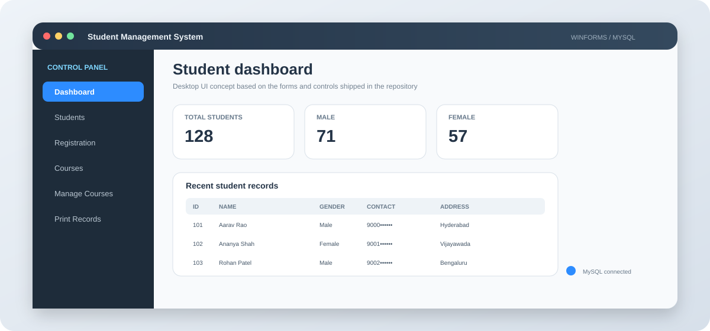

<div align="center">

  

  <h1>Student Management System</h1>
  <p><strong>A Windows desktop student-record and course-management application built with C# WinForms and MySQL.</strong></p>

  
  
  
  
</div>

> **Desktop-first documentation:** this repository is a Windows WinForms application, not a web application.

## 🖥️ The application

The project behaves like a compact desktop control room. `MainForm` provides navigation and dashboard counts, while dedicated forms handle student records, courses, and printing.

```text
MainForm
  ├── Dashboard statistics
  ├── Student registration
  ├── Student management
  ├── Course management
  └── Student printing
             │
             ▼
        C# data classes
             │
             ▼
          MySQL
```

## 🎛️ Modules

| Area | Current capability | Main code |
|---|---|---|
| Dashboard | Total, male, and female student counts | `MainForm` |
| Registration | Add student + photo | `RegistrationForm` |
| Student management | View, search, select, update | `ManageStudent` |
| Course management | Add, update, delete, list | `AddCourse`, `ManageCourseForm` |
| Reporting | Filter and print student records | `PrintStudent` |
| Database | Open/close MySQL connection | `DBconnect` |

## 🖼️ Original application screens

The original README already contained screenshots of the actual application, so this redesign keeps that evidence instead of replacing it with generic mockups.

<p align="center">
  <a href="https://user-images.githubusercontent.com/61797706/199290348-dfed0bd1-dc10-4841-8f60-a78680bc01c2.PNG"></a>
  <a href="https://user-images.githubusercontent.com/61797706/199290343-f28d3e15-c774-4c1f-8953-3d89d1d62ae1.PNG"></a>
</p>
<p align="center">
  <a href="https://user-images.githubusercontent.com/61797706/199290347-be997561-a3d8-4ddd-b4fa-f45abae2d088.PNG"></a>
  <a href="https://user-images.githubusercontent.com/61797706/199290353-b65ce3e7-9cc4-41eb-92a2-a27ab719b250.PNG"></a>
</p>
<p align="center">
  <a href="https://user-images.githubusercontent.com/61797706/199290355-0252ce00-71eb-4176-a16b-1c0e65feae69.PNG"></a>
  <a href="https://user-images.githubusercontent.com/61797706/199290356-3a614684-411d-4c5f-9e5f-5be3c095e4ff.PNG"></a>
</p>

## 👨‍🎓 Student record journey

```text
REGISTER
   │
   ├── Name
   ├── Date of birth
   ├── Gender
   ├── Contact
   ├── Address
   └── Photo
        │
        ▼
    MySQL student table
        │
        ├── DataGridView
        ├── Search
        └── Update
```

The registration/update forms validate required fields and enforce an age range of **10–100 years**.

## 📚 Course management

`CourseClass.cs` covers the course catalog with a deliberately small CRUD surface:

```text
ADD → LIST → UPDATE → DELETE
       │
       └── Course Name / Duration / Description
```

## 🖨️ Print workflow

`PrintStudent.cs` can filter records by all students, male students, or female students, then sends the `DataGridView` to the included `DGVPrinter` helper.

## 🗃️ Database shape

### student

```text
ID
First Name
Last Name
D.O.B
Gender
Contact Number
Address
Photo (BLOB)
```

### courses

```text
Course ID
Course Name
Course Duration
Description
```

## 🔌 Code-to-database path

```text
WinForms event
     │
     ▼
StudentClass / CourseClass
     │
     ▼
DBconnect
     │
     ▼
MySql.Data
     │
     ▼
student / courses tables
```

This is a direct desktop architecture. There is no web API, ORM, or service layer hiding the database operations.

## ⚙️ Local configuration

`DBconnect.cs` currently expects a local MySQL database named `studentdb` on port `3306`.

```text
host     = localhost
port     = 3306
user     = root
database = studentdb
```

Create the database first:

```sql
CREATE DATABASE studentdb;
```

Then create the `student` and `courses` tables using schemas compatible with the SQL statements in the source.

## 🚀 Run it

### Requirements

- Windows
- Visual Studio with .NET Framework desktop tooling
- .NET Framework 4.7.2
- MySQL Server

### Setup

```bash
git clone https://github.com/Sai-Srinivas-P/STUDENT_MANAGEMENT_SYSTEM.git
cd STUDENT_MANAGEMENT_SYSTEM
```

Open `Student Management System.sln` in Visual Studio, restore the included package references, build the solution, verify the MySQL connection, and run.

`Program.Main()` launches `MainForm`.

## 📦 Dependencies

- `MySql.Data`
- `Guna.UI2.WinForms 2.0.2`
- .NET Framework 4.7.2
- Windows Forms
- `DGVPrinter` helper included in the repository

## ⚠️ Code review notes

This is an academic desktop CRUD project, and the source has some problems worth knowing before deployment:

- The database connection is hard-coded.
- `searchStudent()` concatenates search text into SQL instead of using a parameter.
- `updateStudent()` currently issues an `INSERT` statement instead of an `UPDATE`, which is a functional bug.
- The student delete click handler is empty.
- Several event handlers are placeholders.
- No automated test suite is committed.
- No database migration/schema script is committed.
- The application is Windows/.NET Framework-specific.

## 🛠️ Sensible upgrade order

```text
1. Externalize DB credentials
          ↓
2. Parameterize all SQL
          ↓
3. Fix update/delete behavior
          ↓
4. Add validation + error handling
          ↓
5. Add automated tests
          ↓
6. Separate data access from UI
          ↓
7. Consider modern .NET WinForms
```

## 📁 Project map

```text
STUDENT_MANAGEMENT_SYSTEM/
├── Student Management System.sln
├── Student Management System.csproj
├── App.config
├── Program.cs
├── DBconnect.cs
├── StudentClass.cs
├── CourseClass.cs
├── DGVPrinter.cs
├── MainForm.cs
├── RegistrationForm.cs
├── ManageStudent.cs
├── AddCourse.cs
├── ManageCourseForm.cs
├── PrintStudent.cs
├── Properties/
├── Resources/
├── packages/
├── assets/
│   └── student-system-desktop-ui.svg
└── README.md
```

## 🎯 What this project demonstrates

**C# → WinForms → event-driven UI → MySQL ADO.NET → CRUD → DataGridView → image BLOB storage → search → printing/reporting → desktop packaging**

## 📜 License

MIT License. See [`LICENSE`](LICENSE).

<div align="center">
<strong>🎓 Manage students. Organize courses. Keep records printable.</strong>
<br/>
<sub>C# WinForms · MySQL · desktop CRUD</sub>
</div>